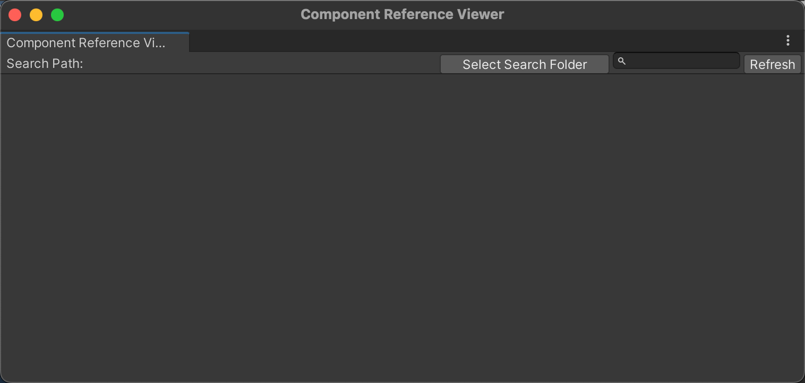
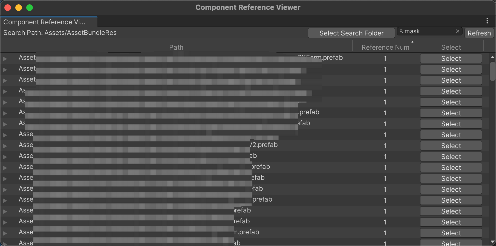
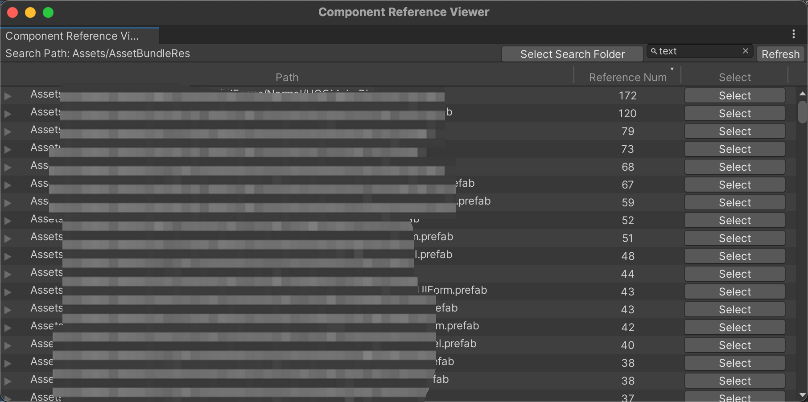

# ComponentReferenceViewer

1. 工具入口 Window/Component Reference Viewer

2. 点击Select Search Folder按钮，选择要搜索的目录
3. 搜索框中输入要搜索的组件的Name或者FullName，不区分大小写
4. 点击Refresh按钮，执行搜索

5. 点击 Reference Num （TreeView的表头），可以按照引用数量进行排序
6. 双击预制体或者点击预制体的Select，会进入该预制体的Prefab Mode编辑模式
7. 双击组件Item或者点击组件的Select，会在Hierarchy面板中选中该子物体
8. 该工具的目的是为了全局浏览组件的引用情况，比如为了优化项目组中的UI预制体上挂载的Mask组件，那么就需要这么一个工具进行全局浏览，方便我们进行一些其他方面的工作。